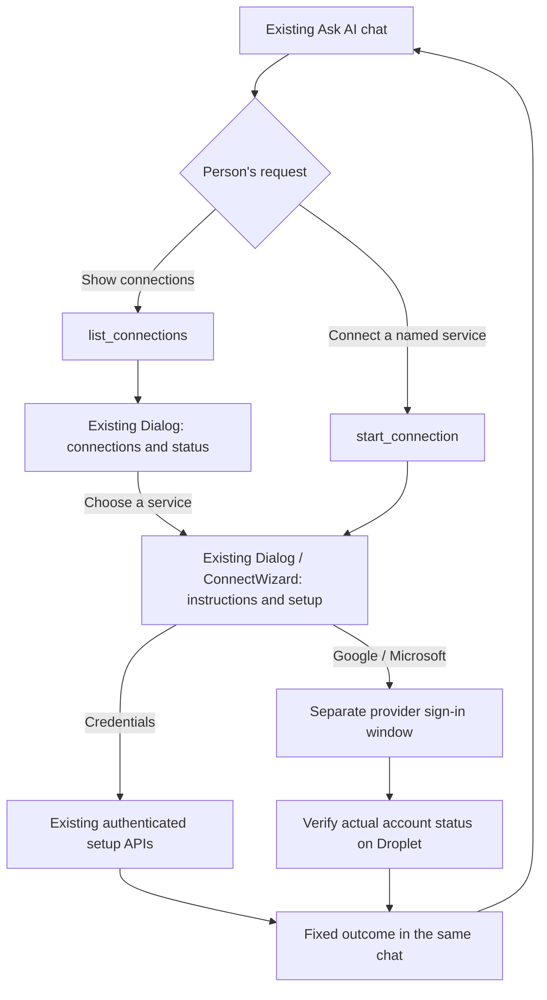

# Connect services through the existing Droplet chat

Ask AI keeps its existing composer, navigation, and message layout. A person asks
"show my connections" or "connect Stripe" in the conversation. The device agent
uses canonical tools to open setup in the existing dashboard dialog, with the
same forms, controls, styling, and instructions used elsewhere in the product.
The person completes setup and continues in the same chat.

## Interaction wireframe

No Connections button is added to the composer. Successful setup-tool responses
automatically open one popup for a fresh tool result, and offer the existing button
style to reopen it. Closing a dialog does not navigate or erase the draft.
Rehydrating a conversation does not reopen old setup forms; changing chats closes
the active form and discards any pending outcome for the old conversation.

## Device architecture

The orchestrator owns the connection overview and provider resolution. The
`packages/tools-core` registry exposes `list_connections`, `start_connection`, and
`disconnect_connection` through the existing agent and MCP dispatch paths. The
connection domain is selected for connection-related requests. Descriptors use the
canonical provider registry, covering personal Google and Microsoft accounts,
mailboxes, calendar subscriptions, and catalog integrations. Unsupported providers
retain truthful setup instructions rather than inventing a connection flow.

The dashboard validates tool-result descriptors, then mounts existing local setup
components. The Patterson API track uses a local descriptor-driven form in the
same dialog, with the server's established legacy test/connect endpoints, its
required route map, and optional certificate trust. It never opens the SQL wizard.
Model-provided input fields and paths never define the credential
form. Passwords and keys go directly from the existing browser form to its existing
authenticated API; the tool, transcript, and model never receive them. Outcomes
contain only fixed product copy. A saved calendar subscription reports that its
first sync is pending; saving credentials is not treated as a successful probe.

Owner/admin roles manage shared integrations and mailboxes. Family users manage
their own supported account and calendar connections. MCP requests resolve the
asserted person's canonical identity and role on the server; a browser cannot
impersonate another person with the assertion header. Removing a connection uses
the existing approval mechanism, owned-record checks, teardown services, and audit
semantics.

## Account approval without leaving chat

Google and Microsoft approval use a window reserved synchronously by the person's
click. If popups are blocked, setup explains how to retry and starts no sign-in
request. A registered-hostname hop happens in that window, preserving the parent
chat and draft. The popup can require a Droplet sign-in at the registered address.

The fixed `/chat/connect-return` destination is allowlisted server-side without
queries, hashes, or arbitrary paths. The callback signal contains only provider,
outcome, and a random correlation nonce. The parent verifies the window source,
origin, nonce, provider, expiry, and live session, then reads actual account status.
A fresh connected timestamp is required before reporting success. Window closure
only triggers a status check. The person can cancel and retry in the setup dialog.
Draft text and staged attachments survive setup; outcome turns do not consume files
waiting in the composer.

## Availability and validation

This PR implements the conversational connection workflow. It remains unreleased
until merged and deployed to a device. Existing provider availability, permission,
network, and administrator-configuration requirements still determine which
connections can complete. No live vendor account is connected during validation.

Tests exercise registry/MCP wiring, prompt budgets, provider resolution, descriptor
validation, identity isolation, existing setup callbacks, popup lifecycle, history
replay, draft/file preservation, and strict OAuth return destinations. Browser QA
uses mock API and tool SSE responses with the actual dashboard components, including
mobile and dark-mode checks. This does not prove live vendor OAuth or credential
verification on a deployed Droplet.

The broader PDF, editable `.pptx`, and `.xlsx` capability direction is outside this
connection workflow; this change makes no claim about those capabilities shipping.
